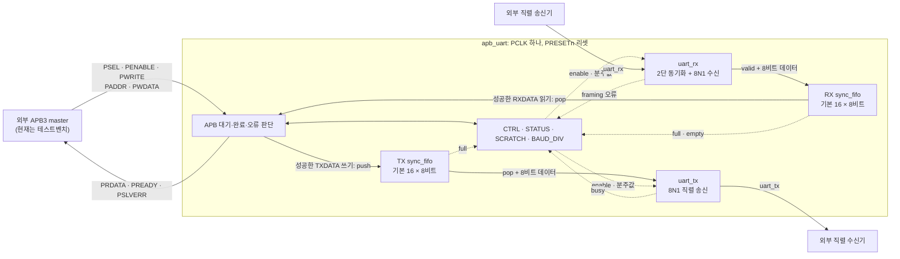
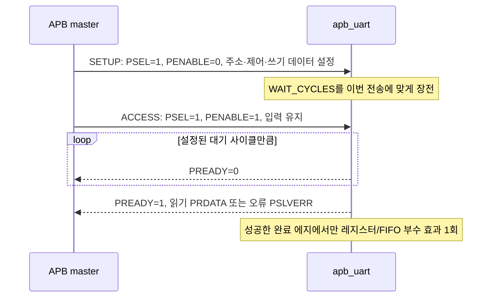
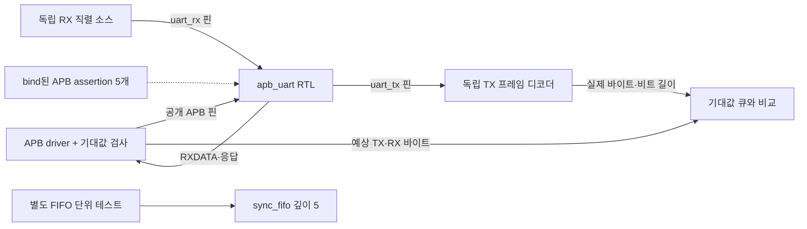

# APB3 UART 아키텍처 (v0.2)

이 문서는 현재 구현된 회로와 검증 구조를 설명합니다. 회로의 최상위 모듈은 [`rtl/apb_uart.sv`](rtl/apb_uart.sv)의 `apb_uart`이며, 32비트 APB3 **slave** 인터페이스와 `uart_rx`·`uart_tx` 핀을 제공합니다. CPU, APB master, FPGA 보드 회로는 이 모듈에 포함되지 않습니다. 레지스터별 정확한 동작 조건은 [사양](docs/specification.md)을, 실행 방법과 측정 결과는 [README](README.md)와 [v0.2 증거](reports/evidence/v0.2/README.md)를 참고하세요.

## 전체 구조

`apb_uart`는 APB 완료 전송을 레지스터 접근이나 FIFO 동작으로 변환합니다. `CTRL`과 `BAUD_DIV`는 송수신 동작을 설정하고, `STATUS`는 FIFO와 UART의 현재 상태 및 수신 오류 기록을 반환합니다. TX와 RX는 별도 FIFO를 사용하므로 APB 접근과 직렬 비트 전송이 서로 다른 속도로 진행될 수 있습니다.

| 구현 파일 | 역할 |
|---|---|
| [`rtl/apb_uart.sv`](rtl/apb_uart.sv) | APB 응답, 레지스터, 오류 검사, 하위 모듈 연결 |
| [`rtl/sync_fifo.sv`](rtl/sync_fifo.sv) | 파라미터화한 동기식 FIFO; TX·RX에 각각 한 개 사용 |
| [`rtl/uart_tx.sv`](rtl/uart_tx.sv) | FIFO 바이트를 시작·데이터·정지 비트로 송신 |
| [`rtl/uart_rx.sv`](rtl/uart_rx.sv) | 비동기 입력 동기화, 비트 중앙 샘플링, 정상 바이트/오류 출력 |

모든 회로는 `PCLK`의 상승 에지에서 동작합니다. `PRESETn`은 낮을 때 활성화되는 비동기 리셋입니다. UART 비트 길이는 별도 생성 클록 대신 `PCLK` 사이클을 세어 만듭니다. 기본 `FIFO_DEPTH`는 16바이트이며, TX와 RX에 같은 깊이를 적용합니다.

## APB 접근과 레지스터

APB 주소·데이터는 각각 32비트입니다. `PADDR`는 이 IP 안에서 `0x00`부터 시작하는 **상대 바이트 주소**로 해석합니다. 상위 SoC의 절대 주소를 연결하려면 외부 주소 디코드·변환 또는 RTL 수정이 필요합니다.

`WAIT_CYCLES`는 기본 0이며, 각 SETUP 단계에서 다시 적용됩니다. 따라서 `PSEL`을 유지하는 연속 전송도 서로 독립적으로 처리합니다. `PREADY`는 ACCESS 밖에서 낮고, `PSLVERR`는 오류 전송의 완료 시점에만 높습니다. 잘못된 접근은 상태를 바꾸지 않고, 오류 읽기의 `PRDATA`는 0입니다.

| 상대 주소 | 레지스터 | 접근 | 주요 기능 |
|---|---|---|---|
| `0x00` | `CTRL` | 읽기/쓰기 | bit 0 TX 활성화, bit 1 RX 활성화; 리셋 값 0 |
| `0x04` | `STATUS` | 읽기 | bit 0 TX full, 1 TX busy, 2 RX empty, 3 RX full, 4 RX overflow, 5 RX framing error |
| `0x08` | `SCRATCH` | 읽기/쓰기 | 32비트 저장 레지스터; 리셋 값 0 |
| `0x0c` | `BAUD_DIV` | 읽기/쓰기 | 비트당 `PCLK` 사이클 수; 리셋 값 16, 허용 범위 4~65535 |
| `0x10` | `TXDATA` | 쓰기 | 하위 8비트를 TX FIFO에 넣음 |
| `0x14` | `RXDATA` | 읽기 | RX FIFO에서 가장 오래된 8비트를 반환하고 완료 시 꺼냄 |

`BAUD_DIV`는 송신 또는 수신 프레임 진행 중 변경할 수 없습니다. 미정의·비정렬 주소, 읽기 전용 쓰기, 쓰기 전용 읽기, 가득 찬 TX FIFO 쓰기, 빈 RX FIFO 읽기 등은 `PSLVERR`로 거부합니다. `STATUS`의 overflow와 framing 오류 비트는 리셋할 때만 지워집니다.

## UART와 FIFO 데이터 흐름

**송신:** 성공한 `TXDATA` 쓰기는 `PWDATA[7:0]`을 TX FIFO에 넣습니다. TX가 활성화되고 FIFO가 비어 있지 않으면 `uart_tx`가 바이트와 현재 `BAUD_DIV`를 프레임 시작 시 저장하고 FIFO에서 한 바이트를 꺼냅니다. 핀은 유휴 `1` → 시작 `0` → 데이터 8비트(최하위 비트부터) → 정지 `1` 순서로 변합니다. 각 비트는 `BAUD_DIV`개의 `PCLK` 사이클 동안 유지됩니다. TX를 비활성화해도 진행 중인 프레임은 끝까지 전송합니다.

**수신:** `uart_rx` 핀은 2단 플립플롭 동기화기를 통과합니다. 수신기는 하강 에지를 감지하고 약 반 비트 뒤 시작 비트가 낮은지 다시 확인한 다음, 데이터 8비트와 정지 비트를 각 비트의 중앙에서 샘플링합니다. 정상 바이트는 RX FIFO에 들어가고 `RXDATA` 읽기로 꺼냅니다. 잘못된 시작은 버리고, 낮은 정지 비트는 바이트를 버리면서 framing 오류를 기록합니다. RX FIFO가 가득 찼다면 새 바이트를 버리고 overflow를 기록합니다. RX 비활성화는 진행 중인 후보 프레임을 중단합니다.

FIFO는 요청 직전의 `full`/`empty` 상태로 push·pop 수락 여부를 정합니다. 빈 상태에서 동시 push·pop은 push만, 가득 찬 상태에서는 pop만 수락합니다. 그 사이 점유량에서는 둘 다 수락하고 바이트 순서를 유지합니다. 리셋은 두 FIFO를 비우고 진행 중인 APB·UART 동작을 중단하며 `uart_tx`를 유휴 `1`로 되돌립니다.

## 현재 검증 구조와 범위

[`tb/tb_top.sv`](tb/tb_top.sv)의 APB driver는 CPU 대신 전송을 만들고, TX 핀 모니터는 DUT 내부 상태를 보지 않고 실제 핀에서 프레임을 해독합니다. RX는 별도의 직렬 소스가 보낸 바이트와 APB로 읽은 값을 비교합니다. [`tb/fifo_tb.sv`](tb/fifo_tb.sv)는 깊이 5에서 FIFO 경계와 포인터 순환을 별도로 검사합니다. [`assertions/apb_uart_assertions.sv`](assertions/apb_uart_assertions.sv)의 assertion은 APB ready/error 타이밍과 오류 시 부수 효과를 검사합니다. 이 assertion은 검증용이며 UART RTL의 데이터 경로는 아닙니다.

`make regress`는 FIFO 1건, `WAIT_CYCLES=0/1/3`의 APB·TX·RX 지정 시험 9건, 고정 seed 20개의 무작위 시험을 실행합니다. v0.2 결과는 [증거 보고서](reports/evidence/v0.2/README.md)에 기록되어 있습니다. 현재 검증은 디지털 시뮬레이션 결과입니다. FPGA 합성·타이밍·실물 보드 동작, CPU·펌웨어 통합, IRQ·DMA·패리티·16550 호환성은 구현 범위에 포함되지 않습니다.
