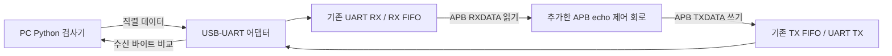

# 합성·타이밍·FPGA 실물 시험 실행 안내

현재 저장소에는 **실행한 범용 합성**, **분석용 iCE40 배치·배선**, **FPGA echo 시험 회로와 PC 검사기**가 있습니다. 실제 FPGA 보드의 모델·클록·핀맵은 아직 정해지지 않았고, 보드 다운로드와 실물 송수신 시험도 아직 수행하지 않았습니다. 실행 결과는 [준비 단계 증거](../reports/evidence/fpga-prep/README.md)에 있습니다.

## 1. 각각 무엇을 확인하나요?

| 단계 | 질문 | 현재 명령 / 상태 |
|---|---|---|
| 범용 합성 | 작성한 RTL을 논리 게이트와 플립플롭으로 변환할 수 있나요? | `make synth`, 실행 완료 |
| FPGA 시험 회로 시뮬레이션 | APB 제어 회로가 기존 UART를 초기화하고 수신 바이트를 다시 전송하나요? | `make test-fpga`, 실행 완료 |
| 분석용 FPGA 배치·배선 | 지정한 칩에 회로를 배치하고 배선을 연결했을 때 내부 클록 목표를 만족하나요? | `make timing-reference`, HX8K/CT256 기준 실행 완료 |
| 보드용 구현 | 실제 FPGA 칩·클록·패키지 핀·전압에 맞게 구현됐나요? | 보드 모델 확정 후 진행 |
| 실물 시험 | 프로그램한 FPGA에서 전송한 바이트가 실제 선을 통해 돌아오나요? | PC 검사기 구현 완료, 실물 실행 대기 |

범용 합성 셀 수는 특정 FPGA의 LUT/FF 사용량과 다릅니다. nextpnr의 최대 주파수는 도구가 배선 지연으로 추정한 값이며 오실로스코프로 측정한 값이 아닙니다. 현재 `timing-reference`는 **실제 보드 핀을 지정하지 않은 분석**이므로, 이 숫자를 사용할 보드의 타이밍 통과 결과로 옮겨 쓰면 안 됩니다.

## 2. 지금 PC에서 실행하기

저장소 최상위 디렉터리에서 실행합니다. 기존 Verilator 도구가 없다면 먼저 [기본 설치](tool-setup.md)를 완료하세요.

```bash
source build/toolchain/env.sh

# 처음 한 번: Ubuntu 26.04 amd64/WSL에 합성 도구 설치
bash scripts/setup-synthesis.sh
source build/synthesis-tools/env.sh

# 문법/경고 검사와 FPGA echo 회로 시뮬레이션
make lint-fpga
make test-fpga WAIT_CYCLES=0
make test-fpga WAIT_CYCLES=3

# 현재 APB UART 자체의 범용 합성
make synth

# echo 제어 회로까지 포함한 기준 FPGA 배치·배선
make timing-reference

# PC 직렬 검사기의 소프트웨어 시험
make test-hardware-tools

# 기존 회귀 포함 9단계를 재실행하고 검토용 증거 저장
make fpga-evidence
```

`source`는 새 터미널마다 다시 실행합니다. 합성 스크립트는 기본 위치의 도구도 자동으로 찾습니다. `make`와 `verilator`를 찾지 못하면 `build/toolchain/env.sh` 적용 여부를 확인하세요. `make fpga-evidence`는 실제 FPGA나 직렬 포트에 접속하지 않습니다.

PC 검사기는 pySerial 3.5를 사용합니다. 현재 개발 환경에는 설치되어 있습니다. 다른 Ubuntu PC에서는 `python3 -c 'import serial; print(serial.VERSION)'`로 확인하고, 없다면 배포판의 `python3-serial` 패키지를 설치하거나 Python 가상환경에서 `python -m pip install -r requirements-hardware.txt`를 실행하세요.

| 성공 표시 | 결과 파일 |
|---|---|
| `FPGA_DEMO_PASS ... echoed=261` | 실행 파일: `build/fpga-demo-wait0/`, `build/fpga-demo-wait3/` |
| `SYNTH_PASS ... latches=0` | `build/synth/apb_uart-wait0-depth16/summary.json`, `yosys.log`, `stat.json`, `netlist.v` |
| `TIMING_REFERENCE_PASS` | `build/timing-reference/latest/summary.json`, `pnr-report.json`, `pnr.log` |
| 호스트 검사기의 `Ran ... tests ... OK` | 실제 OS PTY/소프트웨어 loopback과 오류 주입 시험 결과 |
| `FPGA_PREP_EVIDENCE_PASS` | `reports/evidence/fpga-prep/README.md`, `summary.json`, 개별 로그 |

`summary.json`은 텍스트 편집기로 열어도 됩니다. 명령줄에서는 다음처럼 보기 좋게 출력할 수 있습니다.

```bash
python3 -m json.tool build/synth/apb_uart-wait0-depth16/summary.json
python3 -m json.tool build/timing-reference/latest/summary.json
```

## 3. 합성 결과 읽기

`scripts/run_synthesis.py`는 sv2v로 SystemVerilog를 변환하고 Yosys의 `hierarchy`, `synth`, `check -assert`를 실행합니다. 구조 오류나 래치가 발견되면 실패합니다. 소스·도구·산출물의 해시와 실제 명령을 JSON에 남깁니다. FIFO 깊이와 APB 대기도 바꿀 수 있습니다.

```bash
python3 scripts/run_synthesis.py --wait-cycles 3 --fifo-depth 5
```

현재 FIFO의 메모리가 레지스터로 펼쳐진다는 경고는 숨기지 않고 기록했습니다. 비동기 FIFO 앞 데이터 읽기와 현재 RTL 구조에서 나온 결과입니다. 자원 절약을 위해 BRAM을 쓰려면 FIFO 동작/읽기 지연에 대한 설계 변경과 재검증이 필요합니다.

도구 설치 스크립트는 서명된 Ubuntu 패키지를 `build/synthesis-tools/`에 추출하고, 고정 버전 sv2v 배포 파일의 SHA-256을 확인합니다. 시스템 패키지는 수정하지 않습니다. Ubuntu nextpnr의 칩 데이터베이스 경로가 고정되어 있어 **로컬 실행 복사본의 경로 문자열 한 곳만 같은 길이로 치환**합니다. 원본 실행 파일을 보존하고 `nextpnr-relocation.json`에 원본/복사본 해시를 기록합니다. `/tmp/np-*` 링크는 로컬 데이터베이스를 가리키며 필요할 때 재생성합니다. 기능 알고리즘을 변경하는 패치가 아닙니다.

## 4. 기준 FPGA의 타이밍 범위

`make timing-reference`는 다음 조건을 사용합니다.

- 분석 칩: Lattice iCE40 HX8K, CT256 패키지. 구매/보유 보드를 뜻하지 않습니다.
- Top: `fpga_uart_demo`, 클록 50 MHz, UART 115200 baud, APB 대기 0, FIFO 깊이 16.
- sv2v → Yosys `synth_ice40` → nextpnr pack/place/route → 내부 클록 타이밍 판정.
- I/O 핀은 자동 배치합니다. `--pcf-allow-unconstrained`는 이 분석용 실행에만 사용합니다.
- 실행 seed, 도구 버전, 경로별 타이밍과 자원 사용량을 기록합니다.
- `routed.asc`는 분석 산출물입니다. 실물 프로그래밍에 사용하지 않습니다.

다른 분석 목표는 다음처럼 지정할 수 있습니다. 목표 미달이면 명령이 실패합니다.

```bash
make timing-reference FPGA_CLK_HZ=50000000 FPGA_BAUD=115200 PNR_SEED=1
```

아날로그 신호 품질, 메타안정성 확률, 모든 외부 I/O 타이밍, 실제 보드의 리셋 조건까지 승인하는 검사는 아닙니다. 비동기 UART 입력의 첫 동기화 FF까지 경로와 이후 동기 경로를 보드용 도구에서 구분하고, 리셋 동기화와 제약 누락도 검토해야 합니다. 실제 보드용 Vivado 등의 구현에서는 클록·I/O·CDC 제약을 적용한 뒤 setup/hold, WNS/TNS, 의도하지 않은 미제약 경로, DRC를 확인해야 합니다.

공식 참고: [Yosys 합성](https://yosyshq.readthedocs.io/projects/yosys/en/latest/using_yosys/synthesis/synth.html), [sv2v](https://github.com/zachjs/sv2v), [nextpnr FPGA 구현](https://github.com/YosysHQ/nextpnr), [iCE40 PCF 제약](https://github.com/YosysHQ/nextpnr/blob/main/docs/ice40.md), [AMD 구현 명령](https://docs.amd.com/r/en-US/conversion-methodology/Basic-Non-project-Mode-Tcl-Commands).

## 5. FPGA에서 무엇이 동작하나요?



`fpga/rtl/fpga_uart_demo.sv`가 FPGA의 최상위 모듈입니다. CPU 없이 작은 APB 상태 기계가 `BAUD_DIV`와 `CTRL`을 설정하고, RX 데이터와 TX 여유 공간을 확인해 한 바이트씩 전달합니다. 현재 프로젝트의 APB·FIFO·UART 경로를 모두 사용합니다.

| 포트/파라미터 | 연결 및 의미 |
|---|---|
| `clk` / `CLK_HZ` | 실제 보드 발진기 입력과 그 주파수. `CLK_HZ` 기본값은 0이므로 보드용 빌드에서 지정해야 합니다. |
| `reset_n` | active-low 리셋 입력. 비동기 assert, 두 클록에 걸친 동기 release. 보드 버튼 극성과 필요 시 디바운싱을 확인합니다. |
| `uart_rx` / `uart_tx` | FPGA 디지털 UART 핀. 어댑터 TX→FPGA RX, FPGA TX→어댑터 RX, GND 연결. |
| `ready` | baud 설정과 TX/RX 활성화 완료, active-high. |
| `error` | APB 오류 또는 UART framing/overflow 감지, active-high. 리셋까지 APB echo 제어를 정지합니다. 이미 TX FIFO에 있던 데이터는 전송될 수 있습니다. |
| `BAUD_RATE` | 기본 115200. 가장 가까운 정수 분주값을 사용하므로 실제 baud 오차를 확인합니다. |

16바이트를 보내고 같은 양의 echo를 확인한 다음 다음 블록을 보내는 방식으로 시험합니다. 이 방식은 연결과 데이터 정확성을 확인하며, 최대 속도의 연속 전송 스트레스 시험과는 범위가 다릅니다.

## 6. 실제 보드에서 마무리할 순서

먼저 **보드 제조사/모델/리비전**, **정확한 FPGA part**, **발진기 주파수**, **USB-UART 연결 및 신호 전압**, **리셋 핀/극성**을 확인해야 합니다. 제조사 공식 회로도/제약 파일을 근거로 `fpga/boards/<모델>/`에 보드 wrapper와 핀·타이밍 제약을 추가합니다. 실제 FPGA I/O 전압과 일치하는 USB-UART 어댑터를 사용하세요. RS232의 양/음 전압을 FPGA 핀에 직접 연결하면 안 됩니다.

1. 보드 조건에 맞게 top 파라미터·핀·클록 제약을 확정합니다.
2. 해당 FPGA 도구로 합성·배치·배선을 수행하고 타이밍/DRC 보고서를 검토합니다.
3. 프로그래밍 파일을 생성해 FPGA에 다운로드합니다. 사용한 파일 해시와 보드 정보를 기록합니다.
4. 리셋 후 `ready`가 활성화되고 `error`가 비활성인지 확인합니다.
5. PC에서 아래 검사기를 실행합니다. 포트와 보드 ID, bitstream 경로는 실제 값으로 바꿉니다.

```bash
# 실제 보드 프로그래밍 후 사용할 예시이며, design.bit은 아직 생성되지 않았습니다.
python3 scripts/test_fpga_uart.py \
  --port /dev/ttyUSB0 --baud 115200 \
  --bytes 4096 --seed 1 --board-id MY_FPGA_BOARD \
  --bitstream build/fpga/design.bit \
  --output reports/runs/hardware/uart_echo.json
```

Windows에서 Python을 실행하면 `--port COM3`처럼 지정합니다. WSL에서는 USB 장치가 WSL에 연결되어 실제 `/dev/ttyUSB*` 또는 `/dev/ttyACM*`가 생겼는지 확인해야 합니다. 터미널 프로그램이 같은 포트를 열고 있으면 닫은 뒤 시험합니다.

성공 시 `UART_ECHO_PASS`와 JSON의 `serial_echo_verified: true`를 확인합니다. 불일치/누락/시간 초과/예상 밖 바이트는 실패입니다. 케이블이 없는 상태에서 실패하는지도 확인한 뒤 정상 연결로 다시 통과시킵니다. 리셋과 전원 재인가 후 재시험 결과를 각각 보관합니다.

검사기는 echo만으로 상대 장치의 정체와 프로그램 이미지를 확인할 수 없어 `physical_verified`를 자동으로 true로 바꾸지 않습니다. 실물 완료 증거에는 **보드/배선 사진 또는 기록 + 프로그래밍 로그/파일 해시 + 타이밍 보고서 + 정상/실패 검사 로그**를 함께 보관합니다. 빈 양식은 [실물 시험 기록](board-test-record.md)에 있습니다.

소프트웨어 검사기만 확인하려면 다음 명령을 쓸 수 있습니다. 이 결과는 실물 증거로 사용하지 않습니다.

```bash
python3 scripts/test_fpga_uart.py --port loop:// --software-loopback \
  --output reports/runs/hardware/software-loopback.json
```
